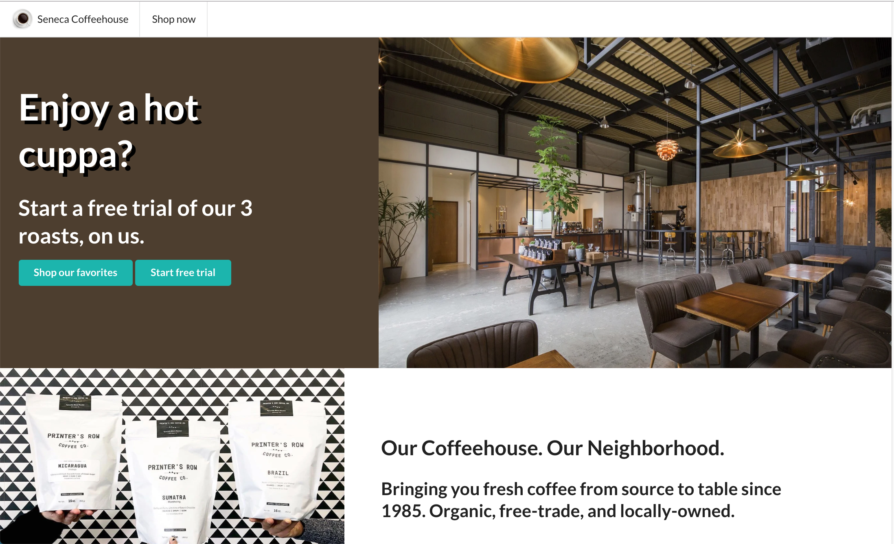
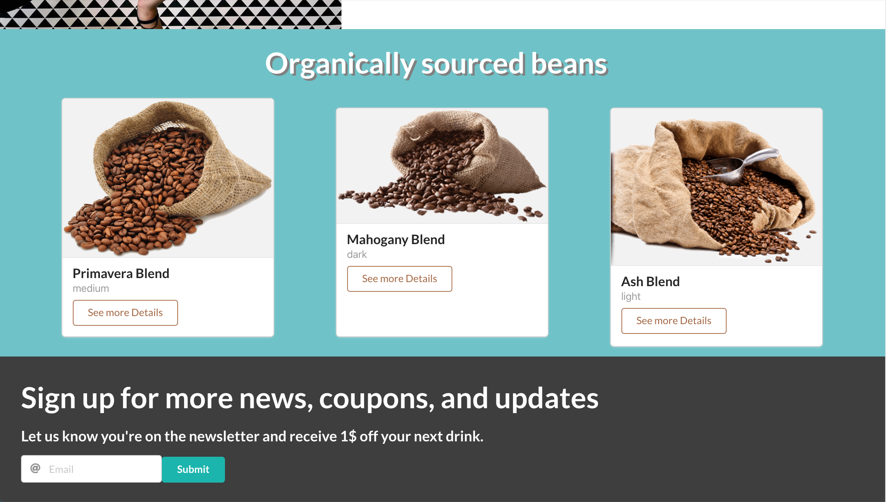

This is a created landing page for a make-believe coffeeshop called Seneca Coffeeshop. Created in 1.5 hours using CSS, Semantic UI, and React.js.

- Clone the repo
- Start with yarn start after installing dependencies.

Screenshots

### `yarn start`

Runs the app in the development mode. 
Open [http://localhost:3000](http://localhost:3000) to view it in the browser.

